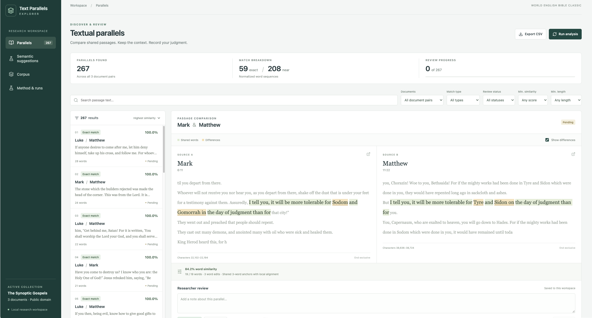

# Text Parallels Explorer

A local research workspace for discovering shared passages, comparing the original wording, and recording a researcher's judgment. An explainable lexical detector finds exact and near matches; an optional semantic view suggests related passages with different wording.



## Quick start

With Docker and Docker Compose installed, run:

```sh
docker compose up --build
```

Open **http://localhost:8000**. The first launch imports the bundled texts, analyzes every document pair, downloads the pinned open-source model, and computes semantic suggestions locally on the CPU. A preparation screen shows live progress and opens the workspace when it is ready. SQLite data, model weights, and generated suggestions persist in a named Docker volume. Stop with `docker compose down`; retaining the volume retains your work.

No API key or paid service is needed. The first build downloads dependencies and base images; the first launch needs internet to download public model weights. Subsequent launches reuse validated results and model files. First-time model preparation can take a few minutes, depending on CPU and connection speed. The application binds to localhost and runs as a single-user workspace, without authentication.

For Docker engines without the Compose plugin, `./run-docker.sh` downloads a checksum-verified official Compose binary into the ignored `.tools/` directory. Alternatively, with Python 3.12+ and Node.js 22+, run `./run-local.sh`.

## Research workflow

- Filter passages by document pair, match type, review status, similarity, length, or text.
- Compare original source passages with surrounding context, word differences, source references, and character offsets.
- Accept or reject a parallel, add a note, and export the filtered results to CSV.
- Rerun analysis without duplicating results or overwriting reviews for unchanged passage ranges.
- Explore semantic suggestions separately from lexical evidence.

The interface uses the available screen width, limits passage line lengths for readability, and adapts navigation and comparison panels for smaller screens.

## Collection

Three complete public-domain texts: Matthew, Mark, and Luke from [World English Bible Classic](https://ebible.org/eng-web/). Their shared passages provide a useful collection for studying textual parallels.

The texts, source URLs, checksums, and verse references are included in `corpus/`. Navigation, headings, footnotes, and verse labels are removed; whitespace is standardized and poetry continuation paragraphs retained. All offsets refer to the bundled text files. See [corpus provenance](corpus/README.md).

## How detection works

1. **Normalize and index.** Tokenize words while retaining their original character positions. Normalize Unicode, case, and apostrophes for comparison.
2. **Retrieve candidates.** Find shared ordered three-word anchors. Alongside contiguous triples, bounded skip anchors allow one intervening word between selected words. Prune very frequent anchors.
3. **Find exact passages.** Extend contiguous anchors into maximal identical normalized word sequences.
4. **Align near matches.** Group nearby ordered anchors into bounded windows and use Biopython local sequence alignment to handle inserted, deleted, or substituted words. Skipped words remain in the alignment.
5. **Score and consolidate.** Compute `1 − word edit distance / max(word counts)`. Defaults require 12 words for exact matches, 16 for near matches, and similarity of at least 0.62. Suppress substantial overlap in both documents; existing contiguous results take priority over added skip alternatives.

“Exact” describes normalized word equality; `raw_exact` records whether the original spans are also identical. Scores measure wording similarity, not the probability of borrowing. Offsets are zero-based Unicode code points, with an exclusive end: `[start, end)`.

The indexed-candidate/local-alignment approach follows established text-reuse methods. See the [algorithm and complexity](docs/ALGORITHM.md), [bounded skip anchors](docs/SKIP_SEEDS.md), and the related open-source [textreuse package](https://docs.ropensci.org/textreuse/).

## Semantic suggestions

A separate view uses the open-source `paraphrase-MiniLM-L6-v2` model to encode one or two adjacent verses as 384-dimensional vectors. Mutual strongest matches above cosine 0.65 become suggestions, excluding substantial overlap with lexical results.

The model runs automatically during first-time workspace preparation. Generated results are cached with the model revision, pipeline settings, corpus/reference hashes, and lexical result ranges. Later launches reuse a valid cache without loading the model. **Run analysis** reruns lexical detection and checks that cache; missing, invalid, or outdated results are recomputed automatically. Semantic suggestions have their own persistent reviews. Cosine is a ranking score, not a confidence percentage, and highlighted windows are candidate regions rather than aligned identical words.

See [model evaluation and regeneration](docs/SEMANTIC.md).

## Storage and architecture

React and TypeScript provide the interface; FastAPI serves the API and static build; SQLite stores the workspace. The Docker image runs one backend worker as a non-root user.

| Table | Purpose |
|---|---|
| `documents` | Source metadata, content checksums, text, and references |
| `parallels` | Canonical document pairs, both passage ranges, scores, types, and evidence |
| `reviews` | Persistent status and note for each lexical parallel |
| `analysis_runs` | Algorithm version, parameters, timing, and per-pair outcomes |
| `semantic_suggestions` | Offline candidates, provenance, and independent reviews |

Content hashes and passage ranges determine stable identities. Unique constraints and upserts prevent duplicate ranges. Analysis publishes atomically; a failure leaves prior results available. Unchanged ranges retain their reviews, and inactive results retain review history. Changed corpus checksums require a fresh database.

Interactive API documentation: **http://localhost:8000/docs**. Preparation state is available at `/api/startup`; `/api/ready` returns 503 until preparation is complete. Failed preparation can be retried from the interface.

## Verification

```sh
python3 -m venv .venv
.venv/bin/pip install -r requirements-dev.txt
.venv/bin/python -m pytest -q
.venv/bin/python scripts/evaluate.py
.venv/bin/python scripts/evaluate_skip_seeds.py
```

With the application running:

```sh
cd frontend
npm ci
npx playwright install chromium
npm run test:e2e
```

On macOS the browser tests also support installed Google Chrome; set `CHROME_PATH` to select another executable. Tests cover source offsets, editing operations, database rollback, duplicate prevention, persistent reviews, filtering, highlighting, exports, error recovery, and responsive layouts. Reproducible fixtures and results are included in `docs/`; see [validation](docs/VALIDATION.md).

## Limitations

- Retrieval is heuristic: common-anchor pruning, bounded skips, candidate windows, and one-best local alignment can miss passages. This is not exhaustive detection.
- Paraphrases without shared ordered words need semantic retrieval; reordered or heavily edited wording remains difficult.
- Alignment may trim changed edges, and overlap suppression can hide alternative boundaries. Formulaic language may produce incidental matches.
- Thresholds were explored on a small development set. Synthetic stress tests and selected known passages do not establish general corpus precision or recall.
- The embedding model can confuse shared topics with shared claims, including negation and reversed roles. Suggestions require human review.
- The bundled semantic pipeline uses verse references and English passages. Arbitrary uploads, multilingual quality, OCR processing, and large-scale retrieval are not supported or validated.
- This is a local, single-user application. Authentication, collaborative editing, and distributed jobs would require additional design.

The workspace helps researchers inspect textual evidence; it does not establish historical dependence or authorial intent.

## License and development

Application code is distributed under the [MIT License](LICENSE). Corpus texts are public domain; model licensing and provenance are documented separately.

OpenAI Codex assisted with architecture, implementation, tests, debugging, and documentation. No AI service is called by the running application.
